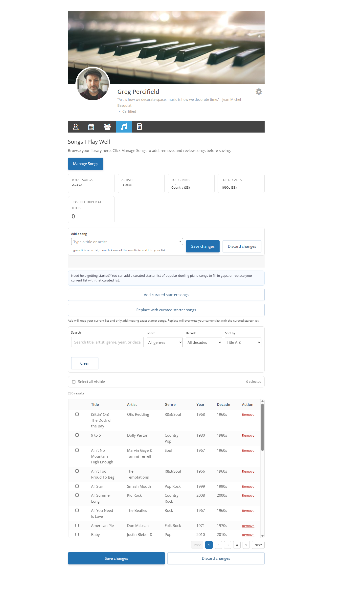
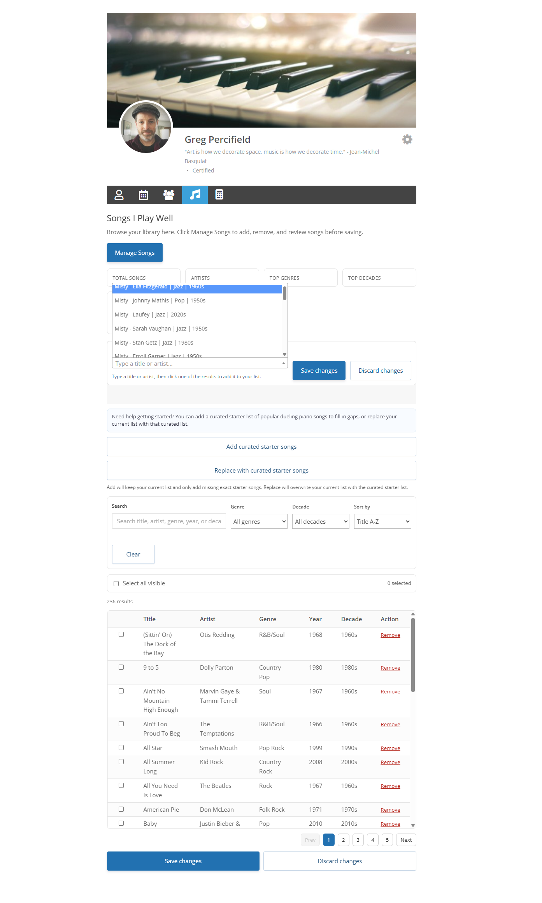
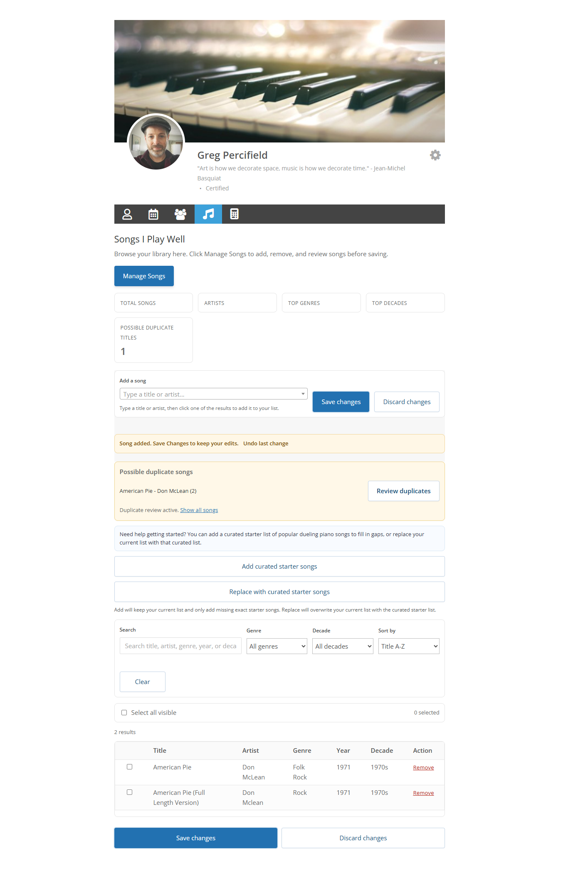

# UM Songs Played Manager

A WordPress plugin designed for use within Ultimate Member profile workflows, allowing users to build and manage a structured song library on their profile.

This plugin was built for musician-facing workflows where users need to search for songs, save structured metadata, review duplicates, and manage their list through a cleaner profile experience than a raw text field.

## Features

- Designed to work within Ultimate Member profile pages and tabs
- Search-based song picker using Select2
- Structured JSON storage in user meta
- Profile table rendering for saved songs
- Dedicated song management interface with:
  - search
  - filters
  - sorting
  - pagination
  - bulk delete
  - duplicate review workflow
- Curated starter-song tools
- Optional webhook dispatch on song changes

## Screenshots

### Library view

### Manage songs

### Duplicate review

## Why I built it

The goal was to replace a clunky freeform profile field with a more structured and user-friendly interface. The plugin focuses on practical UX improvements for real users while keeping the data model flexible enough for downstream integrations.

## Tech notes

- PHP
- WordPress
- Ultimate Member profile workflows
- jQuery
- Select2
- REST API endpoints
- JSON-based user meta storage

## Main workflow

Users can:

1. Open their Songs tab in their profile
2. Search for a song and add it
3. Review duplicates
4. Filter and sort their list
5. Save changes back to structured user meta
6. Optionally trigger webhook updates for external systems

## Project structure

- `fnf-um-songs-played.php` - plugin bootstrap
- `includes/songs-played.php` - main plugin logic
- `assets/js/fnf-songs-tab.js` - management UI behavior
- `assets/css/um-song-picker.css` - UI styling
- `assets/data/dueling_piano_top150.json` - starter-song dataset

## Notes before production use

This project was extracted and cleaned from a real-world workflow. If you adapt the concepts for your own use, you should review:

- route namespaces
- webhook configuration
- field labels
- starter-song data
- Ultimate Member tab and field setup
- profile rendering expectations

## Roadmap

- additional settings screen
- more reusable configuration
- improved public-facing documentation
- optional admin controls for starter data and webhook behavior

## Portfolio / Usage Notice

This repository is shared as a portfolio example of my development work.

It is not offered for open-source use, reuse, redistribution, or production deployment by third parties.

Please do not copy, republish, or deploy this project without permission.
